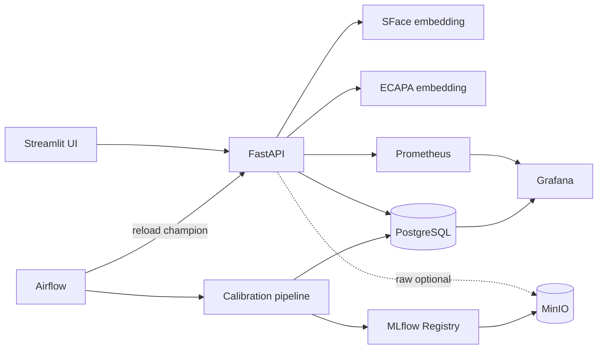

# DDM501 — Face + Voice Verification SaaS MVP

[](https://github.com/TrinhDucDuong/ddm501-face-voice-proctoring/actions/workflows/ci.yml)

## Monitoring Centre

Mở **http://localhost:13000/d/biometric-overview** (`admin` / `admin` trên demo loopback). Grafana tập trung service health, quality, PSI/Evidently, human/synthetic performance, Registry/holdout, review queue, webhook, Airflow/RAI, CPU/RAM/network/IO và Docker logs. Report HTML/JSON cùng origin yêu cầu đăng nhập. Cảnh báo qua bot Telegram `@ddm501_face_voice_proctoring_bot`.

[Vận hành Grafana/Telegram/CI](OPERATIONS.md) · [mapping tiêu chí và pipeline](RUBRIC_MAPPING.md) · [bằng chứng thực tế](VERIFICATION.md) · [capacity/cost](SCALABILITY_COST.md) · [slide thuyết trình](docs/DDM501_Face_Voice_Proctoring.pptx).

Calibration dùng identity-disjoint CV + holdout và max-template scoring giống serving; RAI audit chạy trước gate/promotion. Performance human không chứa nhãn simulation. Kiểm chứng monitoring: `python pipeline/verify_monitoring_centre.py --send-alert`.

## SaaS / private deployment checkpoint

Project hiện có tenant isolation, API key theo vai trò, hosted verification session dùng một lần, consent, manual review, webhook ký HMAC có retry, audit và portal quản lý tập trung. Kiến trúc PaaS được giả lập bằng Docker local; chưa triển khai dịch vụ cloud thực tế.

- Portal: http://localhost:18501 — nhập API key; platform xem quản trị/monitoring, tenant operator xem dữ liệu của tenant.
- Hệ thống khách hàng giả lập: http://localhost:18600 — tạo phiên verify, chuyển sang hosted page, kiểm tra kết quả backend rồi mới cho vào bài thi.
- Hosted page được mở bằng link phiên tạo từ portal/API; không mở `/verify` riêng lẻ.
- Webhook worker metrics: http://localhost:18002/metrics.
- [Hợp đồng tích hợp](SAAS_INTEGRATION.md), [triển khai PaaS/private](DEPLOYMENT.md), [đối chiếu tiêu chí](RUBRIC_MAPPING.md), [kịch bản thuyết trình](DEMO_PRESENTATION.md), [trạng thái tiếp tục](PROJECT_STATE.md).

Sau khi stack healthy và có dữ liệu bootstrap, chạy `python pipeline/provision_local_saas.py` để tạo tenant demo và ghi credential vào `data/local-saas.json` (bí mật, không commit). Chạy `python pipeline/verify_saas.py` để kiểm chứng tích hợp bằng ảnh/WAV thật. Hướng dẫn bootstrap và giới hạn xác thực nằm trong tài liệu tích hợp. Không dùng tài khoản/mật khẩu demo khi public hệ thống.

Hệ thống demo nội bộ cho bài toán xác minh danh tính 1:1 trong kỳ thi tiếng Anh online. Project nối các phần đã học thành một luồng hoàn chỉnh: ingest/ghi danh → embedding → xác minh → Airflow → MLflow Registry → serving API → Prometheus/Grafana.

> Đây là MVP kỹ thuật. Quyết định `REVIEW` phải có người kiểm tra; không dùng một score đơn lẻ để tự động kết luận gian lận. Quality score không phải face PAD hay audio anti-spoof.

## Thành phần

| Thành phần | URL local | Mục đích |
|---|---:|---|
| Streamlit UI | http://localhost:18501 | Tạo hồ sơ, ghi danh, xác minh, xem event |
| FastAPI / docs | http://localhost:18100/docs | API 1:1 face + voice |
| MLflow | http://localhost:15030 | Experiment và Model Registry |
| Airflow | http://localhost:18081 | Pipeline snapshot/calibrate/register/reload |
| MinIO | http://localhost:19101 | Artifact store; raw biometric mặc định tắt |
| Prometheus | http://localhost:19090 | Metrics |
| Grafana | http://localhost:13000 | Dashboard và review queue |
| Alertmanager | http://localhost:19093 | Nhận và nhóm cảnh báo vận hành/ML |
| Drift exporter | http://localhost:18001/metrics | PSI, performance từ feedback |
| PostgreSQL | localhost:15433 | Metadata, enrollment, event |

Tài khoản demo Airflow/Grafana là `admin` / `admin`. API key mặc định là `demo-internal-key`. Chỉ các cổng loopback được publish; hãy đổi toàn bộ secret trước khi đặt lên mạng.

## Kiến trúc



## Chạy lần đầu

Yêu cầu Docker Desktop có tối thiểu khoảng 8 GB RAM và 10 GB trống. Image pretrained chứa PyTorch CPU nên lần build đầu có thể lâu.

```powershell
cd ddm501-face-voice-proctoring
Copy-Item .env.example .env
docker compose config --quiet
docker compose up -d --build
docker compose ps
```

`model-init` tải đúng revision đã pin của YuNet, SFace và SpeechBrain ECAPA từ Hugging Face vào `./models`. Chờ API healthy rồi mở UI:

```powershell
Invoke-RestMethod http://localhost:18100/health
Start-Process http://localhost:18501
```

Quy trình UI:

1. `Thêm hồ sơ`: tạo mã người dùng.
2. `Ghi danh sinh trắc`: thêm ít nhất 2 ảnh và 2 WAV. Nên dùng 3–5 mẫu mỗi loại.
3. `Xác minh`: khai báo danh tính, chụp ảnh và thu câu tiếng Anh mới.
4. Xem kết quả `ALLOW` hoặc `REVIEW`; event xuất hiện trong UI và Grafana.

## Dữ liệu demo 50–100 người

Bootstrap dùng:

- `marcelohaps/lfw` cho ảnh khuôn mặt;
- `mteb/speech-commands-mini` cho audio có `speaker_id`;
- mỗi face identity được ghép giả lập với một voice identity khác nguồn thành `DEMO-xxx`.

Vì ghép giả lập, bộ này chỉ kiểm thử pipeline và không được dùng để công bố FAR/FRR đa phương thức.

```powershell
python -m venv .venv
.\.venv\Scripts\Activate.ps1
pip install -r requirements-pipeline.txt
python pipeline\bootstrap_demo.py --identities 50 --samples 3
python pipeline\bootstrap_demo.py --enroll-existing
```

Có thể đổi `--identities 100`. Script pin immutable dataset SHA và sinh `data/bootstrap/manifest.json` để audit nguồn. `--enroll-existing` có thể chạy lại an toàn: hồ sơ đã ready sẽ được bỏ qua.

## Airflow và MLflow Registry

DAG `biometric_model_pipeline` chạy mỗi Chủ nhật:

1. ingest snapshot có timestamp để truy vết;
2. kiểm tra schema, quality, duplicate, dimension và số lượng dữ liệu;
3. feature engineering tạo genuine/impostor pairs và tìm threshold;
4. log params, metrics, tags, artifact, signature và model vào MLflow;
5. đăng ký alias `candidate`, kiểm tra FAR/FRR và số pairs;
6. chỉ khi qua gate mới chuyển alias `champion`;
7. sinh Responsible AI audit rồi hot-reload API.

Chạy ngay ngoài lịch:

```powershell
docker compose exec airflow-scheduler airflow dags unpause biometric_model_pipeline
docker compose exec airflow-scheduler airflow dags trigger biometric_model_pipeline
```

Muốn promote candidate sau khi review metrics:

```powershell
docker compose exec airflow-scheduler python /opt/project/pipeline/calibrate_and_register.py
docker compose exec airflow-scheduler python /opt/project/pipeline/promotion_gate.py
Invoke-RestMethod -Method Post -Headers @{'X-API-Key'='demo-internal-key'} http://localhost:18100/v1/admin/reload-model
```

API luôn ghi `model_version` vào verification event để truy vết. Nếu MLflow không sẵn sàng, reload trả 503 và API tiếp tục giữ version đang chạy.

## API chính

- `POST /v1/people` — tạo hồ sơ.
- `GET /v1/people` — danh sách và trạng thái đủ mẫu.
- `POST /v1/people/{id}/enroll` — multipart `face_files` / `voice_files`.
- `POST /v1/verify` — multipart `person_id`, `session_id`, `face_file`, `voice_file`.
- `GET /v1/events` — audit/review queue.
- `PUT /v1/events/{id}/feedback` — nhãn ground truth từ proctor để theo dõi performance.
- `POST /v1/simulation/observations` — chỉ dành cho demo drift và phải bật `ENABLE_SIMULATION`.
- `POST /v1/admin/reload-model` — tải `models:/face-voice-risk-bundle@champion`.
- `GET /metrics/` — Prometheus exposition.

Các mutation/list event yêu cầu header `X-API-Key`.

## Hai chế độ model

- `MODEL_BACKEND=pretrained` (mặc định): YuNet + SFace và SpeechBrain ECAPA-TDNN trên CPU. Thiếu weights sẽ fail-closed.
- `MODEL_BACKEND=demo`: DCT ảnh + spectral descriptor audio, chỉ để unit/integration test nhanh. Không dùng score này cho người thật.

Đổi backend hoặc `.env` cần recreate container:

```powershell
docker compose up -d --force-recreate api
```

## Kiểm thử

```powershell
pip install -r requirements-api.txt pytest
pytest -q
python -m compileall api pipeline airflow/dags ui
docker compose config --quiet
```

CI tại `.github/workflows/ci.yml` chạy Ruff, compile, unit/data/model tests, kiểm tra core coverage >80%, validate Compose và build các container. Bốn nhóm test gồm embedding unit, decision policy, data-quality/model-promotion gate và PSI/window monitoring.

## Demo monitoring, drift và feedback

Sau khi stack healthy, chạy simulation qua chính REST API (không ghi thẳng database):

```powershell
python pipeline\simulate_drift.py --samples 120
docker compose restart drift-monitor
```

Simulation tạo một cửa sổ ổn định rồi một cửa sổ bị shift. Sau tối đa 60 giây:

- Grafana hiển thị PSI từng feature, tỷ lệ feature drift và accuracy có feedback;
- Prometheus firing alert `BiometricDataDrift` khi PSI > 0.2 trong 2 phút;
- Evidently report ở `reports/data-drift.html` và summary JSON cùng thư mục;
- Alertmanager nhận alert tại cổng 19093. Cấu hình mặc định chỉ giữ/hiển thị alert; production cần thêm webhook/email/Slack bằng secret.

Gắn nhãn một event đã review:

```powershell
$headers = @{'X-API-Key'='demo-internal-key'}
$body = @{is_genuine=$true; reviewer='proctor-01'; notes='manual review'} | ConvertTo-Json
Invoke-RestMethod -Method Put -Headers $headers -ContentType 'application/json' -Body $body http://localhost:18100/v1/events/EVENT_ID/feedback
```

## Tài liệu nộp bài

- `PROJECT_REQUIREMENTS.md`: problem, use cases, functional/non-functional requirements và metrics có target.
- `ARCHITECTURE.md`: component/data flow, failure modes, tech justification và trade-offs.
- `RESPONSIBLE_AI.md`: fairness proxy, explainability, privacy và ethics/mitigation.
- `RUBRIC_MAPPING.md`: ánh xạ từng tiêu chí chấm điểm tới evidence trong repo.
- `CONTRIBUTING.md`: branching, quality gate và phân công vai trò cần điền tên thật.

Swagger/OpenAPI luôn có tại `/docs` và `/openapi.json`.

## Evidently performance và auto-deploy

Xem [hướng dẫn vận hành](OPERATIONS.md) để cấu hình feedback windows, xem báo cáo model performance, và thiết lập GitHub Actions self-hosted runner tự deploy sau khi CI trên `main` thành công.

## Troubleshooting

- `candidate rejected`: mở MLflow run, xem FAR/FRR hoặc bổ sung đủ >=5 genuine/impostor pairs mỗi modality; champion cũ không bị thay.
- Drift monitor báo `need at least 200 events`: chạy simulation hoặc chờ đủ hai cửa sổ; đổi `MONITOR_WINDOW_SIZE` cho demo nhỏ.
- API 503 khi reload: kiểm tra MLflow/MinIO, alias `champion` và credentials; model đang chạy vẫn được giữ.
- Build thiếu RAM/disk: lần đầu tải PyTorch + weights khá lớn; cấp Docker khoảng 8 GB RAM và 10 GB trống.
- Grafana không có dữ liệu: kiểm tra Prometheus targets `/targets`, exporter `:18001/metrics`, rồi khoảng thời gian dashboard.

## Những gì đã có và chưa có

Đã có: UI enrollment/verification, multi-sample templates, face/voice pretrained embedding, input quality gate, duplicate detection, Postgres audit, optional MinIO raw storage, MLflow aliases, Airflow orchestration, metrics và dashboard.

Chưa được gọi là hoàn thiện production:

- face PAD từ chuỗi video/challenge-response;
- audio replay/deepfake detector (AASIST hoặc model đã đánh giá trên dữ liệu nội bộ);
- ASR kiểm tra random phrase;
- encryption/KMS, SSO/RBAC, retention/deletion workflow;
- queue + autoscaling GPU, canary và load test ở 5.000 concurrent sessions;
- dữ liệu thu có chủ đích từ người dùng Việt Nam và threshold theo thiết bị/môi trường.

Các interface hiện tách embedding, quality, threshold bundle và event schema để thêm bốn model độc lập (`face_embedding`, `face_pad`, `speaker_embedding`, `audio_spoof`) mà không phá API/UI.

## Dừng hệ thống

```powershell
docker compose down
```

Không thêm `-v` nếu muốn giữ PostgreSQL, MinIO và Grafana data.
