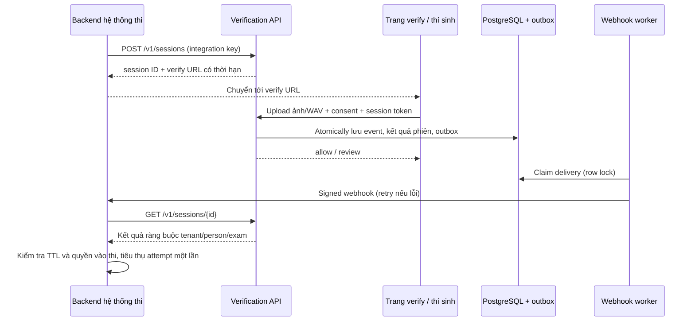

# SaaS verification — hướng dẫn tích hợp

Sản phẩm cung cấp REST API, trang verify có sẵn và portal vận hành. Local Docker mô phỏng các service trên PaaS; cùng mã nguồn có thể triển khai private/on-premise. Hệ thống không tự chèn bước kiểm tra vào phần mềm của bên khác: nhà cung cấp phần mềm phải tích hợp tại backend hoặc khách hàng dùng quy trình review độc lập.

## Luồng và quyền



| Credential | Được làm | Không được làm |
|---|---|---|
| Platform API key | Tạo tenant, cấp/thu hồi key, reload model, xem report monitoring toàn nền tảng | Không mặc định truy vấn dữ liệu tenant khác qua endpoint nghiệp vụ; muốn thao tác phải dùng key tenant |
| Operator key | Ghi danh, verify trực tiếp, review, feedback, audit, retry webhook của tổ chức | Quản trị tenant/model, dữ liệu tổ chức khác |
| Integration key | Tạo hồ sơ, liệt kê hồ sơ và tạo/đọc phiên/kết quả của tổ chức | Ghi danh, quyết định review, ghi feedback, gọi verify trực tiếp hoặc quản trị nền tảng |
| Session token | Đọc trạng thái cơ bản và submit đúng một phiên còn hạn | Chọn người khác, tạo phiên, xem danh sách dữ liệu hoặc submit lần hai |

API keys tenant được lưu dưới dạng SHA-256 digest; key ngẫu nhiên chỉ trả về lúc cấp. Token phiên là HMAC theo secret riêng của server, được đưa trong URL fragment để tránh access-log/query/referrer; trang hosted chuyển token vào Authorization header và xóa fragment khỏi history. TTL mặc định 15 phút, tối đa 30 phút. Cần tách `SESSION_SIGNING_KEY`/`WEBHOOK_MASTER_KEY` khỏi platform key khi triển khai thật.

## Onboarding khách hàng

1. Admin tạo tenant tại portal (hoặc `POST /v1/admin/tenants`), cấu hình callback và return URL thuộc host được duyệt.
2. Cấp operator key cho đội vận hành, integration key cho backend đối tác. Secret không đặt trong JavaScript, app mobile hoặc repository.
3. Operator tạo hồ sơ và ghi danh ít nhất 2 ảnh + 2 WAV. `external_id` có namespace theo tenant; hai tổ chức được dùng cùng mã thí sinh.
4. Backend đối tác tạo phiên, gửi người dùng đến `verify_url`, nhận webhook và luôn đọc lại kết quả server-to-server trước khi cấp quyền thi.

Ví dụ body tạo phiên (header `X-API-Key` chứa integration key):

```json
{"person_id":"UUID đã ghi danh","exam_id":"EXAM-501","request_id":"UUID ổn định của attempt","ttl_seconds":900}
```

`request_id` là idempotency key trong tenant. Gửi lại cùng person/exam trả cùng phiên và cùng URL khi còn pending; thay payload trên cùng request ID bị 409. Một phiên bị hết hạn cần request ID mới. Backend người dùng không được tự chọn person ID ngoài danh tính đăng nhập của mình; demo legacy dùng selectbox thay bước đăng nhập để minh họa.

## Hợp đồng webhook

Body có `id`, `type=verification.completed`, `data` chứa session ID, tenant ID, person ID, exam ID, request ID, status, sequence, expires_at, event_id và model_version. Không gửi ảnh, WAV hoặc embeddings.

- Headers: `X-Webhook-Id`, `X-Webhook-Timestamp` (Unix seconds), `X-Webhook-Signature`.
- Signature: hex HMAC-SHA256(secret, `timestamp + "." + raw_body`). Phải xác thực trên bytes gốc, so sánh constant-time và giới hạn lệch thời gian 5 phút.
- Ghi nhận event ID với unique constraint. Delivery là **at-least-once**; phản hồi 2xx cho bản gửi lặp đã xử lý, không thực hiện side effect lần nữa.
- Retry tối đa 5 lần, backoff 2/4/8/16/32 giây (giới hạn 60); operator có thể đưa delivery failed vào hàng đợi lại.
- Webhook không được redirect sang host khác. Callback chỉ cấu hình bởi platform admin, bị giới hạn bởi `WEBHOOK_ALLOWED_HOSTS`; private mode bắt buộc HTTPS. Hạ tầng thật cần thêm egress/network policy.
- `sequence=1` là kết quả model; `sequence=2` là quyết định giám thị. Không giả định webhook đến đúng thứ tự; fetch trạng thái phiên hiện tại từ API để quyết định.

Ví dụ receiver có signature/timestamp/deduplication và kiểm tra backend: `legacy_demo/app.py`. Không dùng trực tiếp demo login/selectbox trong production.

## Chạy demo

```powershell
docker compose up -d --build
python pipeline/provision_local_saas.py
python pipeline/verify_saas.py
```

Bootstrap media phải đã có (`pipeline/bootstrap_demo.py` nếu môi trường mới). Provision tạo hai thí sinh trong tenant Local English Exam, giữ nguyên dữ liệu demo cũ. Credentials chỉ lưu ở `data/local-saas.json` đã gitignore. Dùng operator key trong file đó để vào portal của khách hàng; không chia sẻ file.

- Hệ thống thi giả lập: http://localhost:18600
- Portal: http://localhost:18501
- Hosted verification: mở link do hệ thống thi/portal tạo, không mở `/verify` trống.
- Bằng chứng: `reports/saas-verification.json`.

Với media bootstrap, camera của người thực không khớp danh tính demo. Để trình diễn allow, upload đúng `data/bootstrap/DEMO-001/face-1.jpg` và `voice-1.wav` cho Candidate DEMO-001. Để dùng khuôn mặt/giọng thật của bạn, tạo hồ sơ và ghi danh trước.

## Giới hạn có chủ đích

Chưa có SSO/mật khẩu người dùng portal, billing, anti-spoof/liveness hoặc xác minh giấy tờ. Portal dùng API keys theo vai trò cho bản môn học. Những chốt về token/replay ở đây bảo vệ giao thức, **không phát hiện replay/deepfake trong nội dung ảnh/giọng**. Kết quả review không phải kết luận gian lận. Raw media mặc định không lưu; embeddings, events, audit vẫn cần retention/deletion policy riêng khi vận hành thật.
