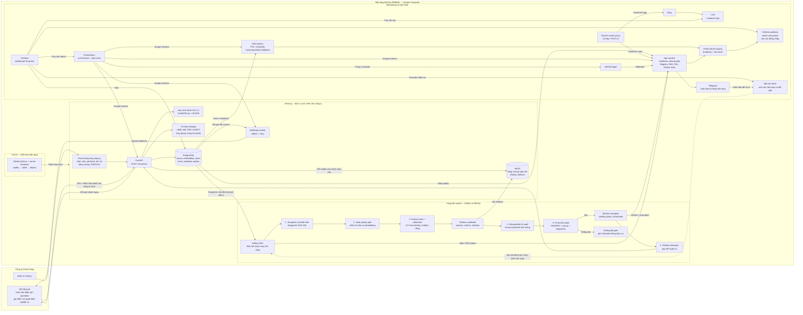

# Kiến trúc tổng quan — DDM501 Face & Voice Integrity

Dự án hiện chạy bằng **Docker Compose trên một máy**, chưa dùng Kubernetes hoặc `node_exporter`. Hệ thống thi của công ty đứng ngoài **nền tảng MLOps DDM501**; bên trong nền tảng là serving, vòng đời model, monitoring/vận hành và CI/CD.

**Ranh giới nghiệp vụ:** công ty tự điều khiển lịch capture, bài thi, điểm và quyết định; DDM501 trả kết quả từng check ngay qua API và signed webhook. Portal chỉ hiển thị dữ liệu của công ty đó. Ảnh/audio của check thường không được lưu theo cấu hình mặc định; ảnh/audio nghi vấn được lưu làm bằng chứng trong MinIO.

**Vòng MLOps chung:** sáu bước đánh số là sáu task thực tế của DAG `biometric_model_pipeline`. Airflow hiệu chỉnh, đánh giá và promotion **identity policy**; serving dùng champion được nạp, còn monitoring quan sát dữ liệu/model/dịch vụ sau triển khai. MiniFASNet/AASIST là detector nghiên cứu có trọng số đã pin, chưa có benchmark anti-spoof trên dữ liệu khách hàng. Gate không đạt thì giữ champion đang phục vụ; MLflow quản lý Registry/artifacts, còn MinIO giữ artifact.

**Phản hồi vận hành:** Prometheus **chủ động kéo** metric từ API, webhook worker, drift-monitor và ops-monitor. Grafana truy vấn Prometheus, PostgreSQL và Loki; Alertmanager gửi sự kiện đến ops-monitor để chuyển cảnh báo kỹ thuật qua Telegram. Người vận hành xem xét rồi mới kích hoạt DAG nếu cần: cảnh báo **không tự động retrain**. Công ty không dùng Telegram này để nhận kết quả check. Docker stats đi qua proxy và ops-monitor; bản Compose hiện không có `node_exporter`.
